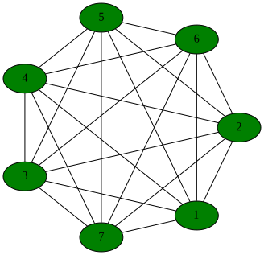

*********************
Examples
*********************

Weiss Two-state Brownion
=========================

In the preface to his classic book on semi-Markov
processes [Howard:1971]_, Howard offers the following guidance
to readers:

.. epigraph:: *It is often said that good ideas are simple; the Markov
        process is no exception.  In fact there is no problem in
        this book that cannot be made clear to a child.  The
        device we use to make such expositions simple is a pond
        covered by lily pads among which a frog may jump.
        Although his jumps may be random, the frog never falls
        into the water...it should be helpful to all readers to
        discuss each chapter using the lily pond analogy.*

While one may question Howard's view of the abstract reasoning
capabilities of children, his advice about frogs and lily pads is
sound. The Two-state Brownion model described by Weiss is that
of a frog on lily pads, where the frog may be sleeping or awake.

Imagine a pond with a frog jumping among seven lily pads as in Figure
:ref:`pond`.  The probability of jumping to pad :math:`i` at or
before time :math:`t=\tau` given that the frog arrived at pad :math:`j`
at :math:`t=0` is given by

.. math:: C_{ij}(\tau) = q_{ij} H_{ij}(\tau)

where :math:`q_{ij}` is marginal probability of jumping from pad
:math:`j` to pad :math:`i` at any time and :math:`H_{ij}(\tau)` is the
conditional distribution of jump times given that the frog arrived at
pad :math:`j` at `t=0` and the destination will be pad :math:`j`.  It
is convenient to assume that the frog will actually move at every
jump, i.e.,

.. math:: \sum_{k\ne j} q_{kj} = 1

and :math:`q_{jj} = 0`.

.. _pond:

   
   Figure 3.  Location of lily pads in a hypothetical pond.

Implementation of
the `Weiss two state Brownion example`_ is in a separate PDF.

.. _Weiss two state Brownion example: weiss.pdf

Susceptible-Infected-Recovered
================================

The Model
-----------
Let's take a paradigmatic system, a set of :math:`N` individuals whose
disease states can be susceptible, infected, or recovered (SIR).
Each individual can infect those other individuals with whom they
have contact, as defined by a contact graph with :math:`M\le N(N-1)`
directed edges. The hazard rate for infecting
a neighboring individual, where a neighbor is a neighbor in the contact
graph, is :math:`\beta_i(t-t_e)`, where :math:`i` is the individual and
:math:`t_e` is the moment the
moment the first individual became infected. The hazard rate for recovery
of an individual is :math:`\gamma_i(t-t_e)`, where :math:`t_e` is the moment
the individual first becomes infected.
This model doesn't include varying susceptibilities for infection.

We will walk through the decision-making process for construction of
a GSPN to simulate a trajectory of this system for different conditions.
We can think of the complexity in three steps.

  * Identical individuals, exponentially-distributed transitions
  * Unique individuals, exponentially-distributed transitions
  * Unique individuals, arbitrarily-distributed transitions

States and Transitions
^^^^^^^^^^^^^^^^^^^^^^^

The first step is to identify the states and transitions
possible in the model. The marking of the GSPN can represent the
same system state multiple ways, among which we choose according
to requirements for calculating transitions. Some possible representations
of the state:

  #. Each individual's state is :math:`p_i` where :math:`p_i\in(S,I,R)`.
  #. A list of individuals in each state, :math:`(n_S, n_I, n_R)`.
  #. A presence-absence count for each individual in each state,
     :math:`p_{iS}\in(0,1)`, :math:`p_{iI}\in(0,1)`, :math:`p_{iR}\in(0,1)`.

Each of these corresponds to a different data structure used to
store the model's marking.

  #. :math:`N` tokens, each with the the value :math:`(S,I,R)`, where each
     token sits, for all time, at a place for each individual. A token would
     hold :math:`(1,0,0)`, or :math:`(0,1,0)`, or :math:`(0,0,1)`.

     .. image:: images/metapopsir.*
        :width: 300 px
        :alt: Three individuals with state (S,I,R) and infection and recovery transitions.

  #. Three places, one for each of  :math:`(n_S, n_I, n_R)`, which contain
     a list of individuals in the state associated with that place.
     Each token at place :math:`S`
     would contain the ID of an individual. Moving tokens then changes the
     individual's disease state.

     .. image:: images/sirnonexponential.*
        :width: 400 px
        :alt: Three places, with three infection transitions and three recoveries.

  #. A token with no internal state. There are :math:`3N` places, one for
     each combination of individual and disease state, :math:`(i, SIR)`.
     The image below shows infections between individuals 1 and 2 and 
     between 2 and 3, but not between 1 and 3.

     .. image:: images/sirindividual.*
        :width: 300 px
        :alt: Nine places with three recoveries, showing four of the six infection
              transitions.

If we enumerate every possible transition in this system, for
every possible initial marking, there are :math:`M` infection transitions
and :math:`N` recovery transitions. Any particular infection transition
needs to answer two questions, what is its distribution if it's enabled,
and what does it do when it fires? The pseudocode for a transition class
has these two methods::

  Enabled(UserState s, LocalMarking lm, double te, double t0)->(bool, distribution)
  {
    // examine local marking.
    return (is_enabled, distribution_object);
  }

  Fire(UserState s, LocalMarking lm, double t0, RandGen rng)->void
  {
    // change the local marking.
  }

To determine enabling, it needs to know
the state of two individuals whose indices are :math:`(k,l)` and the time
at which the first individual, :math:`k`, became infected, :math:`t_{ke}`.
The state of the individuals must be part of the local marking, which is
the value of the marking at the places which are ordered inputs and outputs to
the transition within the GSPN. The framework will store automatically the
first time step at which the transition becomes enabled and return it as
:math:`t_e`. The framework may ask multiple times whether a transition is
still enabled, each time setting :math:`t0` to the current system time.
A transition which is still enabled may or may not return the same distribution
each time it is asked. It could look at the new marking and return something
different.

For this infection transition,
if :math:`k` is infected and :math:`l` is susceptible, then the cumulative
distribution for this transition is

.. math:: F(t)=1-e^{-\int_{t_e}^t\beta_k(s-t_{ke})ds}.

We might specify this distribution as a Gamma or Weibull distribution.
A distribution object has methods to return hazard rate, survival, or
cumulative distribution. It isn't one or the other.

The three different ways to store the marking, listed above, therefore
don't inherently change the number of transitions in the system.
What they change is the form of the calculation of enabling and of
firing. Case 1 requires examination of the token to see its state.
Case 2 requires finding the correct individual's token within
a list of tokens at the place. Case 3 requires just finding whether
there is, or is not, a token at the place. We tend to use Case 3
because the whole system can be specified purely by stochiometry
of the transition, which is a count of how many tokens are needed
at a transition's inputs and outputs and how many are moved during
firing.

Grouping Transitions
^^^^^^^^^^^^^^^^^^^^^

We are accustomed to seeing a diagram for SIR with
exponentially-distributed transitions so that there are just
three places, each of which holds a count of S, I, and R.
This is a kind of grouped transition.

     .. image:: images/sirexponential.*
        :height: 150px
        :alt: The classic SIR diagram. Three places, and two transitions,
              one for infection and one for recovery.

The recovery transition in this classic diagram represents a recovery
by any one of the infecteds. The distribution of the recovery transition
is the distribution of firing times for the first of those recovery
transitions that would fire. In other words, it is the minimum of
the stochastic variables for the recovery transition of each individual.
If we look back at the theory section, we see that, given a set
:math:`k` of recovery transitions, the pdf of their minimum firing time is the
derivative of the product of their survival distributions,

  .. math:: f(t)=\frac{d}{dt}\prod_k G_k(t, t_{ek}).

Each of those survivals, :math:`G_k(t,t_{ek})`, has its own enabling time.
This :math:`f(t)` has the same form as what we have called the waiting
time :math:`w_i(t)` in previous discussions. When our grouped transition
fires, it has to select one of the infected individuals to recover, and
this is done according to the time-dependent stochastic probability,

  .. math:: \pi_{k}(t)=\lambda_k(t,t_{ek})\prod_k G_k(t, t_{ek})/f(t)

When the grouped transition fires, it has to look at the time at which
it fires, calculate :math:`\pi_{k}(t)` for each sub-transition to create
a probability mass function, and choose among them in order to decide which
individual's state it should change from I to R. Calculation of the waiting
time and time-dependent stochastic probability can be done in closed form
only for some very particular situations, most commonly that the
transition distributions are all exponential. In that case,
the cumulative waiting time is

  .. math:: W(t)=1-e^{-\sum_k \gamma_k t}

where :math:`\gamma_k` is the constant parameter of the exponential
distribution, and the stochastic probability is time-independent

  .. math:: \pi_i(t)=\frac{\gamma_i}{\sum_k \gamma_k}.

Further, if we choose not to track individuals uniquely through the
whole of the simulation, then we can skip selection of the correct
individual to recover and store susceptibles and infecteds just as
a total count.

The exponential distribution isn't the only one that can be grouped,
however. The main problem with simulation of non-exponential models
for SIR is that the representation grows as :math:`M=N(N-1)`. If we
model each susceptible as having the same susceptibility to infection,
then we can create
a single infection transition for all of the susceptibles infected
by any infected.

  .. math:: w(t)=nG_k(t,t_{ek})^{n-1}\frac{d}{dt}G_k(t,t_{ek})

This waiting time corresponds to multiplying the hazard rate
by the current number of susceptibles. The stochastic probability mass
function for which susceptible is chosen will always be uniform
for this limited case.

Further Complications
^^^^^^^^^^^^^^^^^^^^^^^
We haven't exhausted all of the ways one could choose to
model an SIR system. For instance, if we had exponentially-distributed
transitions and metapopulations, we could have a token containing
a count of S, I, and R, and put one of those tokens at each place,
where places correspond to particular metapopulations for which the
infection and recovery rates are different. Then we can add
metapopulation-to-metapopulation movement or infection rates.

Implementation of Case 3
---------------------------
Let's choose Case 3, which has a separate place for each
pair of individual and disease state.  This is implemented
as an example called ``sir_mixed.cpp``.

Define Types
^^^^^^^^^^^^^^

The code will progress
in two stages. First define the types, then create instances.
First things first, let's make a random number generator for the
system::

  using RandGen=std::mt19937;

The token doesn't need any
internal information because the state is carried by the place::

  struct IndividualToken {
    IndividualToken()=default;
  };

We have to come up with unique keys for the places and transitions.
We could make them compact some way, but let's be correct before
we get fancy::

  struct SIRPlace {
    int64_t disease;
    int64_t individual;
    SIRPlace()=default;
    SIRPlace(int64_t d, int64_t i) : disease(d), individual(i) {}
    // Create <, ==, and << operators. See code.
  };

  struct SIRTKey
  {
    int64_t ind1;
    int64_t ind2;
    int64_t kind;

    SIRTKey()=default;
    SIRTKey(int64_t c1, int64_t c2, int64_t k) : ind1(c1), ind2(c2), kind(k) {}
    // Again create <, ==, and << operators.
  }

The data types are overkill, but that's fine. We established that the
marking could be just a count of 0 or 1 tokens, but the library only
has one way to store markings, as a list of tokens. That is sufficiently
general. It's called an uncolored list because we won't select tokens by
their ID. At this point, we need to define only the local marking,
which is the part the transitions will see::

  using Local=LocalMarking<Uncolored<IndividualToken>>;

We also have the option of adding our own parameters to the overall state
of the system for convenience. Keep in mind that, if some transition
modifies these parameters and another one reads them, the only way to
ensure the system remains consistent is to recalculate every transition
distribution afterwards. For this case, we'll put our :math:`\beta` and
:math:`\gamma` in here.::

  struct WithParams {
    // Put our parameters here.
    std::map<int,double> params;
  };

We are going to be using a class called ExplicitTransition
which is a representation of a GSPN. It's time to create our
transition classes. The base class for transitions needs to
know how the marking is stored, the random number generator,
and any additions we've made to the state::

  using SIRTransition=ExplicitTransition<Local,RandGen,WithParams>;

We might as well also make a shorthand for the distribution
classes we'll use. These are templated only because they involve
the random number generator.::

  using Dist=TransitionDistribution<RandGen>;
  using ExpDist=ExponentialDistribution<RandGen>;

Now it's time to make a transition. We saw pseudocode above.
We expect the Enable method to examine the local marking, whose inputs
are an ordered list of tokens containers at places, and return
a distribution. The firing function should move those tokens.::

  class InfectNeighbor : public SIRTransition
  {
    virtual std::pair<bool, std::unique_ptr<Dist>>
    Enabled(const UserState& s, const Local& lm,
      double te, double t0) const override {
      if (lm.template InputTokensSufficient<0>()) {
        return {true, std::unique_ptr<ExpDist>(new ExpDist(s.params.at(0), te))};
      } else {
        return {false, std::unique_ptr<Dist>(nullptr)};
      }
    }

    virtual void Fire(UserState& s, Local& lm, double t0,
        RandGen& rng) const override {
      BOOST_LOG_TRIVIAL(trace) << "Fire infection " << lm;
      lm.template TransferByStochiometricCoefficient<0>(rng);
    }
  };

The notation for ``lm.template InputTokensSufficient<0>()`` is a rarely-seen
but perfectly normal (for C++) way to call the templated method
``InputTokensSufficient`` on the LocalMarking object.
The template paramter, that ``<0>``, says that this is the first,
and only for this simulation, type of token. Had we defined our
local marking with::

  using Local=LocalMarking<Uncolored<IndividualToken>,Uncolored<OtherToken>>;

then there would be a token type ``<1>``. This 
transition assumes that the GSPN will be hooked together in such a
way that there are two inputs, one from an S place, one from an I, with
stoichiometric coefficients of -1 on each, so that the ``InputTokensSufficient``
method can just count the tokens to determine if the transition is enabled.
We could, alternatively, do the work ourselves::

  class InfectNeighbor : public SIRTransition
  {
    virtual std::pair<bool, std::unique_ptr<Dist>>
    Enabled(const UserState& s, const Local& lm,
      double te, double t0) const override {
      int have_i=lm.template Length<0>(0)>0;
      int have_s=lm.template Length<0>(1)>0;
      if (have_i && have_s) {
        return {true, std::unique_ptr<ExpDist>(new ExpDist(s.params.at(0), te))};
      } else {
        return {false, std::unique_ptr<Dist>(nullptr)};
      }
    }

    virtual void Fire(UserState& s, Local& lm, double t0,
        RandGen& rng) const override {
      // Move from input place 1 to place 3 (output) one token.
      lm.template Move<0>(1, 3, 1);
    }
  };

This version assumes the first place is the infector, the second
place the susceptible, and the fourth place the newly-infected token's place.
We ensure our assumptions are correct when constructing the
GSPN later. The ExplicitTransitions representation is itself
parameterized::

  using SIRGSPN=
    ExplicitTransitions<SIRPlace, SIRTKey, Local, RandGen, WithParams>;

We created a ``LocalMarking`` with which a transition can grab
tokens from places to which it is connected in the GSPN. The
ExplicitTransitions will create its own set of internal keys
for the places and transitions, so that the ``Marking`` used 
by the system uses this set. It's an annoyance, but it lets the
code create more efficient graph structures. Because of this,
we ask the ``ExplicitTransitions`` object how it annotates places
for the ``Marking`` storage.::

  using Mark=Marking<SIRGSPN::PlaceKey, Uncolored<IndividualToken>>;

The state of the system is now the marking, the enabling times
of all transitions, and our little bit of user state we threw in::

  using SIRState=GSPNState<Mark,SIRGSPN::TransitionKey,WithParams>;

Create Instances
^^^^^^^^^^^^^^^^^^^^^
We've made types to represent the parts of the GSPN, but we
haven't made the GSPN instance yet. There is a builder object to
do this for us::

  BuildGraph<SIRGSPN> bg;

We take this builder object and add all of the places and
then all of the transitions, which are connected to those
places. Remember from above that the order matters, because
that order is how a transition knows to access its local marking.
When building the GSPN, each place is created by its PlaceKey.
Each transition is identified by its transition key, then
the list of edges to places, where each edge has stoichiometry,
and finally by including the transition object itself.
Look for places as a pair of (disease state, individual) and
for transitions as a triple of (individual, individual, reaction_kind).::

  SIRGSPN
  BuildSystem(int64_t individual_cnt)
  {
  BuildGraph<SIRGSPN> bg;
  using Edge=BuildGraph<SIRGSPN>::PlaceEdge;

  enum { s, i, r };

  for (int64_t ind_idx=0; ind_idx<individual_cnt; ind_idx++) {
    for (int64_t place : std::vector<int>{s, i, r}) {
      bg.AddPlace({place, ind_idx}, 0);
    }
  }

  for (int64_t left_idx=0; left_idx<individual_cnt-1; left_idx++) {
    bg.AddTransition({left_idx, left_idx, 0},
      {Edge{{i, left_idx}, -1}, Edge{{r, left_idx}, 1}},
      std::unique_ptr<SIRTransition>(new Recover())
      );

    for (int64_t right_idx=left_idx+1; right_idx<individual_cnt; right_idx++) {
      SIRPlace left{i, left_idx};
      SIRPlace rights{s, right_idx};
      SIRPlace righti{i, right_idx};

      bg.AddTransition({left_idx, right_idx, 0},
        {Edge{left, -1}, Edge{rights, -1}, Edge{left, 1}, Edge{righti, 1}},
        std::unique_ptr<SIRTransition>(new InfectNeighbor()));

      SIRPlace lefts{s, left_idx};
      SIRPlace lefti{i, left_idx};
      SIRPlace right{i, right_idx};

      bg.AddTransition({right_idx, left_idx, 0},
        {Edge{right, -1}, Edge{lefts, -1}, Edge{right, 1}, Edge{lefti, 1}},
        std::unique_ptr<SIRTransition>(new InfectNeighbor()));
    }
  }
  return std::move(bg.Build());
  }

The use of ``unique_ptr`` helps us avoid memory leaks.
We've build a GSPN. Now what? We need to create an
initial marking and to run the system.

Initializing the State
^^^^^^^^^^^^^^^^^^^^^^^^^
We already made an ``SIRState`` type. We can create it and
initialize our ``WithParams`` extra state.::

  SIRState state;
  state.user.params[0]=beta;
  state.user.params[1]=gamma;

More interesting is creating our first individuals in susceptible
states and making one of them an infected. The ``Marking`` doesn't
use the same ``SIRKey`` that we defined, so we have to translate our
keys and then add the token to the marking with a free function ``Add``::

  for (int64_t individual=0; individual<individual_cnt; ++individual) {
    auto susceptible=gspn.PlaceVertex({0, individual});
    Add<0>(state.marking, susceptible, IndividualToken{});
  }

We want one of those to be an infected. Here's a complicated way to
initialize the infected. Move a token from susceptible to infected,
after first choosing one at random.::

  // The initial input string moves a token from susceptible to infected.
  auto first_case=static_cast<int64_t>(
      smv::uniform_index(rng, individual_cnt));
  BOOST_LOG_TRIVIAL(trace)<<"First case is "<<first_case;
  int64_t first_s=gspn.PlaceVertex({0, first_case});
  int64_t first_i=gspn.PlaceVertex({1, first_case});
  auto input_string=[&first_s, &first_i](SIRState& state)->void {
    Move<0,0>(state.marking, first_s, first_i, 1);
  };
  input_string(state);

The template ``<0,0>`` says that this is moving the ``Uncolored<SIRToken>``
specified first in the list of token types to the local marking.

We have now made everything necessary to describe the model.
This model could be run in continuous time or discrete time.
It could be run with any number of exact algorithms or inexact
algorithms. We next instantiate an exact algorithm in
continuous time to which we will hand our model.

OutputFunction for Measurement
^^^^^^^^^^^^^^^^^^^^^^^^^^^^^^^^
We need to see some results. An output object will look
at changes to the state of the system and record what
happens. This object's methods are very general and take
a simple form.::

  template<typename SIRState>
  struct SIROutput
  {
    int64_t step_cnt{0};

    void operator()(const SIRState& state) {
      ++step_cnt;
      BOOST_LOG_TRIVIAL(debug) << "trans " << state.last_transition
          << " time " << state.CurrentTime() << " step " << step_cnt;
      BOOST_LOG_TRIVIAL(trace) << state.marking;
    }

    void final(const SIRState& state) {
      BOOST_LOG_TRIVIAL(info) << "Took "<< step_cnt << " transitions.";
    }
  };

The trick to writing one of these is to look up in the
reference section what's in the state. You'll find the
current time, the last transition, and, of course, the user-added
parameters, which can include any recorded information you like
to add during firing of a transition.

Create an Exact Dynamics
^^^^^^^^^^^^^^^^^^^^^^^^^^^
This library currently implements just a few ways to take
the model and find the next step. There are two pieces to
this. The ``StochasticDynamics`` collects all enabled transitions
into a list and presents them to a ``Propagator`` which then
uses statistical methods to choose among the list of transitions::

  using Propagator=NonHomogeneousPoissonProcesses<int64_t,RandGen>;
  Propagator competing;
  using Dynamics=StochasticDynamics<SIRGSPN,SIRState,RandGen>;
  Dynamics dynamics(gspn, {&competing});

The various propagators are stronger or weaker at dealing with
the different types of distributions. This one, the
``NonHomogeneousPoissonProcesses`` propagator, works best
with distributions which specify a hazard rate. It uses
Anderson's algorithm underneath. The
``PropagateCompetingProcesses`` propagator uses a simpler
and much slower First Reaction method.

Because the next time step is determined by the mathematically-defined
minimum of the stochastic variables, we can just hand our
GSPN object to the dynamics and ask it for the next step.::

  dynamics.Initialize(&state, &rng);

  bool running=true;
  while (running) {
    running=dynamics(state);
    output_function(state);
  }
  output_function.final(state);

We can stop the loop at any point, but it will return
that it is not running at any point when there are no
enabled transitions.

Implementation of Case 1
---------------------------

If we were to implement the first representation of the
state, where each token has the value :math:`(s,i,r)`,
how would we define the tokens and transitions?
The token itself is just a struct.::

  struct MetaToken {
    int s;
    int i;
    int r;
    MetaToken()=default;
    MetaToken(int s, int i, int r) : s(s), i(i), r(r) {}
  };

More interesting are the transitions. How do we grab
and read or modify the token? We have to look inside the
token in the local marking. This is done by applying a function
to the token. We pass into the local marking a functor, but
the local marking returns two things, whether it found
a token and then the result of the functor.::

  class Infect : public MetaTransition {
    virtual std::pair<bool, std::unique_ptr<Dist>>
    Enabled(const UserState& s, const Local& lm, double te,
        double t0) const override {
      bool found;
      bool have_infector;
      std::tie(found, have_infector)=
        lm.template GetToken<0>(0, ->bool {
          return mt.i>0;
        });
      assert(found);
      bool have_susceptible;
      std::tie(found, have_susceptible)=
        lm.template GetToken<0>(1, ->bool {
          return mt.s>0;
        });
      assert(found);
      if (have_infector && have_susceptible) {
        return {true, std::unique_ptr<ExpDist>(new ExpDist(s.params.at(1), te))};
      }
    };

    virtual void Fire(UserState& s, Local& lm, double t0,
        RandGen& rng) const override {
      int from_place=1;
      int to_place=1;
      int token_cnt=1;
      lm.template Move<0,0>(from_place, to_place, token_cnt,
        ->void {
        assert(mt.s==1 && mt.i==0);
        mt.i=1;
        mt.s=0;
      });
    }
  };

We are still checking for a susceptible and an infected to determine
enabling, and then the firing transition moves a susceptible into
an infected state. It just does it by modifying the token
rather than moving the token to a place.

Bovine Viral-Diarrhea Virus on a Dairy Farm
============================================
There is an excellent paper by [Viet:2004]_ and others on
Bovine viral-diarrhea virus (BVDV) spread in dairy farms.
In this paper, the authors construct and run a discrete, stochastic,
continuous-time model for herds of cows at a dairy farm.
We describe now
how one would implement their simulation with the Semi-Markov
library instead of writing the whole thing by hand.

There will be two layers to this simulation.

1. Farm management for a dairy farm. Data for this model comes
   from published studies on such topics as typical farm sizes,
   parturition timing, and cow life span. This model was run
   and validated on its own before further complication.

2. Disease spread on that farm. This disease can cause
   transient or persistent infection. It can cause 
   abortion in the cow, depending on timing of infection.

In a larger context, the single-farm simulation could be used
to estimate, statistically, how long it takes from introducing
an infected cow to finding an infected cow on a truck to another
farm. This would then form the basis for a stochastic farm-to-farm model,
even on a national scale, which would incorporate both
known farm management practices and uncertainty about disease
processes.

Dairy Farm Model
------------------
The dairy farm model groups cows into four herds, the
calves, heifers before breeding, heifers after breeding,
and dairy cows. We typically make diagrams like
this below.

.. figure:: images/bvd_gist.*
   :align: center
   :width: 200px

There are a host of rules for the farm. For instance, the
male calves are sold at about ten days. Heifer breeding
times, likelihood of giving birth, and likelihood of selling
or destroying a dairy cow all enter the model as hazard
rates in the GSPN. This GSPN is a formalization of the
diagram above.

.. figure:: images/viet-farm.*
   :align: center
   :height: 300px

You don't see in the figure above that the rates of transitions
are quite complicated because they are taken from 
field observations of farm management practices.

For this model, each token in the simulation represents
a unique cow. The token carries a birth date and records
the cow's parity. Transitions will move cows from one herd
to another, or out of the simulation. Births create new tokens.

Disease Model
----------------
The disease model is more complicated than just SIR
because it accounts for immunity and persistent infection.
It also labels infection states differently depending on
how long the cow has been pregnant because this determines
the likelihood of survival and/or persistent infection of
the calf.

.. figure:: images/viet-factored.*
   :height: 400px

Overlaying this model on top of the farm model means
that each cow can now be both in a herd and in
one of these disease states. It requires composing the
two graphs. The token still represents unique cows.

Adding Intervention to the Model
---------------------------------
We've described what was in the paper. What would
it look like if we added a vaccination intervention
to this model? Vaccination would create a new
state for the disease portion. We could account for
availability of a veterinarian by including a second
type of token in the model.

.. figure:: images/viet-vet.*
   :width: 300px

There would could be a
veterinarian-at-work place and then a separate
veterinarian-at-farm place for each farm in the model.
The token then moves to farms with some hazard rate
and dwells at each farm for a time. While the token
is present at the farm, a herd can transition from
susceptible to an immune-vaccinated state.

