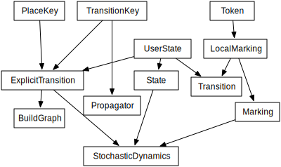

***********************
Tutorial
***********************

Using ExplicitTransitions to Construct a GSPN
===============================================

The ExplicitTransitions class implements the GSPN concept.

The Type of the GSPN Model
------------------------------

The author of the code supplies building blocks to this class:

* A token type. It should have an ostream ``operator<<`` defined.
  It may have any necessary data, such as a birth date
  or size of truck. It must have a default constructor. The simplest
  choice is to construct a `POD type <http://en.wikipedia.org/wiki/C++11#Modification_to_the_definition_of_plain_old_data>`_.

* A storage container for tokens at a place. The allowed option
  is Uncolored<TokenType>, which is an ``std::vector.``

* A PlaceKey, which is another POD type to uniquely identify
  a place in the GSPN. It needs less-than, equal-to, and print
  operators.

* A TransitionKey, which uniquely identifies transitions in the
  GSPN. It needs less-than, equal-to, and print
  operators.

* UserState. The system state consists of marking, enabled
  transitions, and the absolute time. The optional UserState
  struct will add arbitrary members to the state for convenience.
  If a transition were to modify this state such that other
  transitions would have new different enabling or distributions,
  the system would no longer be semi-Markov. This state is
  a good place to put constant parameters or links to
  external data, such as weather.

* A random number generator. The system assumes a single
  generator for everything. This class supports the C++
  ``random`` requirements.

Because the library offers choices in how to define the pieces,
it will be necessary to build the GSPN and the its dynamics
in steps. There are natural dependencies among the pieces,
defined by what each entity is

An example of a ``PlaceKey`` from an SIR model shows that defining
such a struct is verbose but painless::
   
    struct SIRPlace
    {
      size_t disease;
      size_t individual;

      SIRPlace()=default;
      SIRPlace(size_t d, size_t i)
      : disease(d), individual(i)
      {}

      friend inline
      bool operator<(const SIRPlace& a, const SIRPlace& b)
      {
        return lazy_less(a.disease, b.disease, a.individual,
          b.individual);
      }

      friend inline
      bool operator==(const SIRPlace& a, const SIRPlace& b)
      {
        return (a.disease==b.disease)&& (a.individual==b.individual);
      }

      friend inline
      std::ostream&
      operator<<(std::ostream& os, const SIRPlace& cp)
      {
        return os << '(' << cp.disease << ", " << cp.individual<<')';
      }
    };

The template parameters for ``ExplicitTransitions`` are as above::

  typedef LocalMarking<Uncolored<TokenType>> Local;
  typedef ExplicitTransitions<PlaceKey, TransitionKey, Local,
                              RandGen, UserState> GSPN;

The ``LocalMarking`` class is the marking of input and output tokens
for a particular transition. Instead of using ``PlaceKey`` to identify
particular sets of tokens, it assumes the transition can access its
edges with an ordinal (first, second, third). The idea is to define
transitions which don't need to know how their marking is indexed and
stored.

Define Transitions
-------------------

A transition has three responsibilities. Determine when it
is enabled, choose a continuous variable distribution function
for its firing time, and modify the marking when it fires.
Enabling and calculating a distribution happen at the same time,
so they are in one function.

A transition inherits from the ``ExplicitTransition`` template.
It acts on the local marking to produce distributions or move
tokens::

    using Transition=ExplicitTransition<Local,RandGen,WithParams>;
    using Dist=TransitionDistribution<RandGen>;

    class InfectNeighbor : public Transition
    {
      virtual std::pair<bool, std::unique_ptr<Dist>>
      Enabled(const UserState& s, const Local& local_marking,
              double te, double t0) const override
      {
        if (local_marking.template input_tokens_sufficient<0>())
        {
          return {true, std::unique_ptr<Dist>(
              new WeibullDistribution(s.params.at(0), te))};
        }
        else
        {
          return {false, std::unique_ptr<Dist>(nullptr)};
        }
      }

      virtual void Fire(UserState& s, Local& local_marking,
                        RandGen& rng) const override
      {
        local_marking.template transfer_by_stochiometric_coefficient<0>(rng);
      }
    };

The ``Enabled()`` method's parameters are

* **UserState** - This is the same as specified above. It could
  include parameters or a pointer to inhomogeneous drivers of the system.

* **local_marking** - Most of the work here is manipulation of the
  local marking. It has methods to add a token, remove a token, move
  a token, read a value from a token, or modify a token. It also has
  convenience methods to move all tokens associated with a marking.
  The local_marking contains stochiometric coefficients for the
  transition.

* **enabling_time** - If the transition was previously-enabled,
  this is the previous enabling time. Otherwise, it is the current
  absolute time of the GSPN.

* **current time** - The current absolute time of the system.

For a newly-enabled transition, the current time and enabling time
will be the same. The `enable` method will be called any time
a transition fires which shares an input or output place.
If this transition was enabled and should remain so, then it
likely wants to keep its original enabling time.

Using ExplicitTransitionsBuilder
----------------------------------
The implementation of ``ExplicitTransitions`` requires that
we construct it with a builder which then produces the GSPN
object. The builder has just three methods, `add_place()`,
`add_transition()`, and `build()`. It checks that transitions
have, as inputs and outputs, places which exist. It ensures
every PlaceKey and TransitionKey is unique. The signatures
of its methods::

   void BuildGraph::AddPlace(const PlaceKey&, size_t token_layer);

   typedef std::tuple<PlaceKey,int> BuildGraph::PlaceEdge;

   void BuildGraph::AddTransition(const TransitionKey&,
       const std::vector<BuildGraph::PlaceEdge>&,
       std::unique_ptr<ExplicitTransition<<Local,RandGen,WithParams>);

The `PlaceEdge` contains a PlaceKey and a stochiometric coefficient,
which should be negative on inputs and positive on outputs, and specifies
the number of tokens required and the number to move when firing.

For example, we can take advantage of the C++ initializer_list
to construct a GSPN succinctly::

    GSPN
    build_system(size_t individual_cnt)
    {
      BuildGraph<GSPN> bg;
      using Edge=BuildGraph<GSPN>::PlaceEdge;

      enum { s, i, r };

      for (size_t ind_idx=0; ind_idx<individual_cnt; ind_idx++)
      {
        for (size_t place : std::vector<int>{s, i, r})
        {
          bg.AddPlace({place, ind_idx}, 0);
        }
      }

      for (size_t left_idx=0; left_idx<individual_cnt-1; left_idx++)
      {
        bg.AddTransition({left_idx, left_idx, 0},
          {Edge{{i, left_idx}, -1}, Edge{{r, left_idx}, 1}},
          std::unique_ptr<SIRTransition>(new Recover())
          );

        for (size_t right_idx=left_idx+1; right_idx<individual_cnt; right_idx++)
        {
          SIRPlace left{i, left_idx};
          SIRPlace rights{s, right_idx};
          SIRPlace righti{i, right_idx};

          bg.AddTransition({left_idx, right_idx, 0},
            {Edge{left, -1}, Edge{rights, -1}, Edge{left, 1}, Edge{righti, 1}},
            std::unique_ptr<SIRTransition>(new InfectNeighbor()));

          SIRPlace lefts{s, left_idx};
          SIRPlace lefti{i, left_idx};
          SIRPlace right{i, right_idx};

          bg.AddTransition({right_idx, left_idx, 0},
            {Edge{right, -1}, Edge{lefts, -1}, Edge{right, 1}, Edge{lefti, 1}},
            std::unique_ptr<SIRTransition>(new InfectNeighbor()));
        }
      }

      // std::move the transitions because they contain unique_ptr.
      return std::move(bg.build());
    }

Create Marking and State
----------------------------------
The last step is to create the marking and state.
There is one implementation of a marking in the library.
While we defined a `PlaceKey` above, the `ExplicitTransitions`
class uses a different place and transition key internally,
chosen by the Boost Graph Library implementation. Both are
just type `size_t`. The marking and state are therefore::

  using Mark=Marking<size_t, Uncolored<IndividualToken>>;
  using State=GSPNState<Mark,TransitionKey,UserState>;

  State state;

If the `UserState` had a member named `parameters`, then we could access
it as `state.user.parameters`.

How do we initialize the marking? Unfortunately, the marking doesn't
use our `PlaceKey`, so we have to add a translation step from
the `PlaceKey` we know to the `size_t` we don't::

  size_t susceptible=gspn.PlaceVertex(
      PlaceKey{Disease::Susceptible, individual_idx});
  add<0>(state.marking, susceptible, IndividualToken{});

The GSPN remembers the original `PlaceKey` and will translate
for us. The second line adds a new token to the marking.

That's everything that defines the model and the state of the system.
We made places, transitions, and a marking. The next step is
to simulate a trajectory of the system.

Simulating the Trajectory of a Semi-Markov GSPN
=================================================

Given a representation of a GSPN, what steps will simulate
a trajectory from that GSPN? As a semi-Markov model, the GSPN
tracks in time the state of a system and defines the possible
transitions to next states of the system. The core matrix of a
semi-Markov model is just that, the probability of any next state
and the probability of when that a particular state happens.
We simulate a trajectory by looking at only the transitions which
are enabled for the current state. This is the *partial core matrix.*
Given this partial core matrix, a propagator selects the next state.

The partial core matrix has two responsibilities. For the
underlying GSPN, it enforces the rule, central to this kind
of semi-Markov model, that distributions of transitions are
recalculated only when a transition fires which shares marking.
Sharing markings is the only permitted way to express dependence among
processes in the system. A distribution may depend arbitrarily
on external state, such as temperature, but no transition can
affect the distribution of another transition except by changing
the marking.

The partial core matrix also has a responsiblity
to present to a propagator
distributions in time of the currently-enabled competing processes.
The propagator is a function which samples these distributions to
return the next transition to fire.::

  using HazardPropagator=NonHomogeneousPoissonProcesses<TransitionKey,RandGen>;
  HazardPropagator competing_hazards;
  using GeneralPropagator=PropagateCompetingProcesses<TransitionKey,RandGen>;
  GeneralPropagator other_processes;
  using Dynamics=StochasticDynamics<SIRGSPN,SIRState,RandGen>;
  Dynamics dynamics(gspn, {&competing_hazards, &other_processes});

It is the StochasticDynamics class that coordinates, inside, with
the partial core matrix. It will take
enabled transitions from the GSPN and give their distributions
to the appropriate propagator, depending on whether that propagator
can calculate the firing time of that distribution.
When a transition changes the marking,
the StochasticDynamics object is able to track which parts of the
marking changed and enable or disable transitions appropriately.

Finally, the main loop becomes short::

    dynamics.Initialize(&state, &rng);
    bool running=true;
    auto nothing=->void {};
    while (running) {
      running=dynamics(state);
      output_function(state);
    }
    output_function.final(state);

Here, ``output_function`` is an object which acts on the state
and gathers results.

Observations of the State
==========================

After each transition, we observe the state of the
system using the GSPN object and the GSPNState object.

.. cpp:class:: afidd::smv::GSPNState\<Marking,UserSate\>
   
   This class is the state of the system.

.. cpp:member:: Marking\<Place,Tokens\> GSPNState::marking

   The marking is saved as a `marking` member. The member function
   `state.marking.modified()` will list which places changed
   during the last transition.

.. cpp:function:: double GSPNState::current_time() const

   The absolute time of the system.

.. cpp:member:: UserState GSPNState::user

   This member is an instance of the class `UserState.`

For example, an instance of the following class observes
when the number of infected individuals within a population
has passed a given threshold::

  template<typename GSPN>
  class SIROutputFunction
  {
  public:
    typedef void result_type;

  private:
    size_t _pop_cnt;
    size_t _ind_cnt;
    size_t _threshold;
    std::vector<size_t> _infected_per_pop;
    std::vector<double> _first_passage_time;
    std::vector<bool> _passed;

  public:
    SIROutputFunction(size_t population_cnt,
      size_t individuals_per_metapopulation, size_t threshold_for_passage)
    : _pop_cnt(population_cnt), _ind_cnt(individuals_per_metapopulation),
      _threshold(threshold_for_passage),
      _first_passage_time(population_cnt, 0), _passed(population_cnt, false),
      _infected_per_pop(population_cnt, 0)
    {

    }

    result_type operator()(const GSPN& gspn, const SIRState& state)
    {
      auto& modified=state.marking.modified();
      for (auto place_idx : modified)
      {
        // Translate the internal place index into the PlaceKey
        // used to define the GSPN when building the graph.
        SIRPlace p=gspn.vertex_place(place_idx);
        if (p.disease==1)
        {
          bool filled=(length<0>(state.marking, place_idx)>0);
          if (filled)
          {
            _infected_per_pop[p.metapop]+=1;
            if (_infected_per_pop[p.metapop]==_threshold)
            {
              _first_passage_time[p.metapop]=state.current_time();
              _passed[p.metapop]=true;
              BOOST_LOG_TRIVIAL(info)<<"Population "<<p.metapop
                <<" at time "<<state.current_time();
            }
          }
        }
      }
    }
  };

We use such an object by calling it within the main loop::

    size_t transition_cnt=0;
    auto nothing=->void {};
    for ( ;
      std::get<1>(next)<std::numeric_limits<double>::max();
      next=propagate_competing_processes(system, nothing, rng))
    {
      BOOST_LOG_TRIVIAL(debug) << "trans " << std::get<0>(next) << " time " <<
          std::get<1>(next);
      ++transition_cnt;
      output(gspn, state);
    }
    