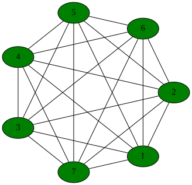

*********************
Introduction
*********************

The ``Semi-Markov`` library is designed to streamline the process of
creating efficient simulations of a large class of systems called
semi-Markov processes [Howard:1971]_.  Semi-Markov processes naturally
arise in many contexts including epidemiology [Viet:2004]_, physiology,
ecology, atmospheric sciences, reliability engineering and risk
management.  This broad range of applications suggest the value of
designing a generic library for simulating complex semi-Markov
processes, independent of the particular application area.  

The unifying idea on which this library is based is that there
typically are many different pathways for a complex system to evolve
between timesteps.  Each pathway can be viewed as an elementary
stochastic process with a user specified time-dependent transition
rates and a rule for modifying the overall internal state of the
system.  At each instant of time, these elementary processes
"compete", figuratively speaking, for the chance to change the state
of the whole system.  Each time step in the simulation corresponds to
an event -- a "winner" is selected thus changing the internal state of
the system and the sampling from the corresponding statistical
distribution to determine the time increment.  This competing process
view provides a framework for users to develop simulations for complex
models in an incremental manner.

It is easy to show that competing processes with exponentially
distributed transition times have time-independent transition rates.
This is the norm in some application areas such as chemical kinetics.
In contrast, it is manifestly inappropriate for many biological
applications such as physiology, ecology and epidemiology.  For
example, a classic paper by Stocks [Stocks:1931]_ clearly shows that
the latent period for measles (the distribution times between
infection and the appearance of symptoms) does not follow an
exponential distribution. Stocks' raw data from cases in London circa
1931, along with optimal fits to exponential, gamma, Weibull, and
log-normal distributions computed using the ``SciPy`` statistical
library, are shown in :ref:`latent_period`.  The fit of the data to
the exponential distribution is very poor while the fits to the other
distributions are very good.

.. _latent_period:

.. figure:: images/Stocks_fitted_data.*
   :scale: 50%
   :align: center

   Figure 1.  Distribution of latent periods for measles in London
   circa 1931

This simple example shows that exclusive reliance on exponential
distributions may lead systematic biases in stochastic simulations of
epidemiological process.  Therefore, this library provides support for
general semi-Markov models based on competing processes with general
probability distributions of transition times.  

Organization of library
---------------------------

It is implemented using three cooperating layers:

* **Finite state machine**: High-level interface for initializing the
  system, iterating over time steps and gathering relevant tracing
  data for post-processing.  

* **Semi-Markov process**: "Middleware" responsible for statistically
  unbiased choice among all possible competing processes at a given
  time step.

* **Generalized stochastic Petri net**: Low-level coordination and
  bookkeeping related to the user-defined competing processes
  including distributions of transition times, modification of system
  state and various dependence relationships.

This organization has many practical advantages:

* The semi-Markov process layer can be viewed as a very efficient,
  general purpose, stochastic simulation engine that supports
  arbitrary statistical distributions for event times.  This layer
  contains no model-specific user code, thus can be independently
  verified and validated.

* Typically, the itself model is completely defined by instantiating
  components of the Petri net.  The Petri net layer automates most of
  the tedious and error-prone bookkeeping steps associated with the
  execution of the model.

* The library strictly enforces a separation of the static components
  that define the structural aspects of the model and the dynamic
  components that define the evolving state during a simulation.  This
  separation makes it possible to detect many critical programming
  errors associated with multithreading at compile time.

Acknowledgements
--------------------

This library was created by the Analytical Framework for Infectious
Disease Dynamics (AFIDD) group at Cornell University in conjunction
with the USDA Agricultural Research Service.  The AFIDD group is
supported by funds from the Department of Homeland Security.

Availability and distribution
-------------------------------

This library is in the public domain.  

Frogs on lily pads
---------------------

In the preface to his classic book on semi-Markov
processes [Howard:1971]_, Howard offers the following guidance
to readers:

.. epigraph:: *It is often said that good ideas are simple; the Markov
	      process is no exception.  In fact there is no problem in
	      this book that cannot be made clear to a child.  The
	      device we use to make such expositions simple is a pond
	      covered by lily pads among which a frog may jump.
	      Although his jumps may be random, the frog never falls
	      into the water...it should be helpful to all readers to
	      discuss each chapter using the lily pond analogy.*

While one may question Howard's view of the abstract reasoning
capabilities of children, his advice about frogs and lily pads is
sound.

Imagine a pond with a frog jumping among seven lily pads as in Figure
:ref:`pond`.  The probability of jumping to pad :math:`i` at or
before time :math:`t=\tau` given that the frog arrived at pad :math:`j`
at :math:`t=0` is given by

.. math:: C_{ij}(\tau) = q_{ij} H_{ij}(\tau)

where :math:`q_{ij}` is marginal probability of jumping from pad
:math:`j` to pad :math:`i` at any time and :math:`H_{ij}(\tau)` is the
conditional distribution of jump times given that the frog arrived at
pad :math:`j` at `t=0` and the destination will be pad :math:`j`.  It
is convenient to assume that the frog will actually move at every
jump, i.e.,

.. math:: \sum_{k\ne j} q_{kj} = 1

and :math:`q_{jj} = 0`.

.. _pond:

   
   Figure 3.  Location of lily pads in a hypothetical pond.

***This section is incomplete***
