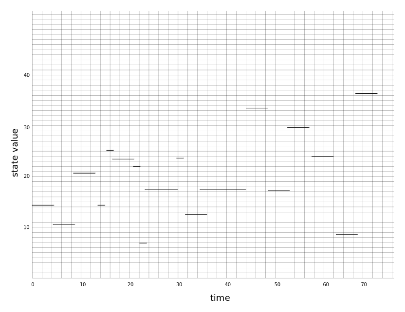
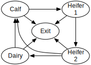

==================================================
Introduction
==================================================

The ``Semi-Markov`` library is designed to streamline the process of
creating efficient simulations of a large class of systems called
semi-Markov processes [Howard:1971]_.  Semi-Markov processes naturally
arise in many contexts including epidemiology [Viet:2004]_, physiology,
ecology, atmospheric sciences, reliability engineering and risk
management.  This broad range of applications suggest the value of
designing a generic library for simulating complex semi-Markov
processes, independent of the particular application area.  

The unifying idea on which this library is based is that there
typically are many different pathways for a complex system to evolve
between timesteps.  Each pathway can be viewed as an elementary
stochastic process with a user specified time-dependent transition
rates and a rule for modifying the overall internal state of the
system.  At each instant of time, these elementary processes
"compete", figuratively speaking, for the chance to change the state
of the whole system.  Each time step in the simulation corresponds to
an event -- a "winner" is selected thus changing the internal state of
the system and the sampling from the corresponding statistical
distribution to determine the time increment.  This competing process
view provides a framework for users to develop simulations for complex
models in an incremental manner.

It is easy to show that competing processes with exponentially
distributed transition times have time-independent transition rates.
This is the norm in some application areas such as chemical kinetics.
In contrast, it is manifestly inappropriate for many biological
applications such as physiology, ecology and epidemiology.  For
example, a classic paper by Stocks [Stocks:1931]_ clearly shows that
the latent period for measles (the distribution times between
infection and the appearance of symptoms) does not follow an
exponential distribution. Stocks' raw data from cases in London circa
1931, along with optimal fits to exponential, gamma, Weibull, and
log-normal distributions computed using the ``SciPy`` statistical
library, are shown in :ref:`latent_period`.  The fit of the data to
the exponential distribution is very poor while the fits to the other
distributions are very good.

.. _latent_period:

.. figure:: images/Stocks_fitted_data.png
   :scale: 50%
   :align: center

   Figure 1.  Distribution of latent periods for measles in London
   circa 1931

This simple example shows that exclusive reliance on exponential
distributions may lead systematic biases in stochastic simulations of
epidemiological process.  Therefore, this library provides support for
general semi-Markov models based on competing processes with general
probability distributions of transition times.  

=======================
Organization of library
=======================

It is implemented using three cooperating layers:

* **Finite state machine**: High-level interface for initializing the
  system, iterating over time steps and gathering relevant tracing
  data for post-processing.  

* **Semi-Markov process**: "Middleware" responsible for statistically
  unbiased choice among all possible competing processes at a given
  time step.

* **Generalized stochastic Petri net**: Low-level coordination and
  bookkeeping related to the user-defined competing processes
  including distributions of transition times, modification of system
  state and various dependence relationships.

This organization has many practical advantages:

* The semi-Markov process layer can be viewed as a very efficient,
  general purpose, stochastic simulation engine that supports
  arbitrary statistical distributions for event times.  This layer
  contains no model-specific user code, thus can be independently
  verified and validated.

* Typically, the itself model is completely defined by instantiating
  components of the Petri net.  The Petri net layer automates most of
  the tedious and error-prone bookkeeping steps associated with the
  execution of the model.

* The library strictly enforces a separation of the static components
  that define the structural aspects of the model and the dynamic
  components that define the evolving state during a simulation.  This
  separation makes it possible to detect many critical programming
  errors associated with multithreading at compile time.

==================================================
Acknowledgements
==================================================

This library was created by the Analytical Framework for Infectious
Disease Dynamics (AFIDD) group at Cornell University in conjunction
with the USDA Agricultural Research Service.  The AFIDD group is
supported by funds from the Department of Homeland Security.

==================================================
Availability and distribution
==================================================

This library is in the public domain.  

==================================================
Background
==================================================

What is a hazard?
-----------------

**Discrete case**

The discrete case is much easier to understand that the continuous
case because it can be explained without employing any results from
calculus.  Throughout this section, :math:`\bf{X}` will be assumed to
real-valued random variable.  For example, :math:`\bf{X}` could
represent latent periods for measles.

It frequently happens that random samples of the real valued variables
such as :math:`\bf{X}` are actually analyzed on a discrete scale.
For example Stocks' data on latent periods of measles in
:ref:`latent_period` is based on daily visits by patients.  

The (cumulative) distribution of :math:`\bf{X}` is defined as

.. math:: F_{X}(k) = \mathcal{P}[x \le k]

assuming :math:`F_{X}(\infty) = 1`.  It is easy to see that the 
density can be expressed as the difference in adjacent values of the 
distribution

.. math:: 
   :nowrap:

   \begin{eqnarray}
   f_{X}(k) & = & \mathcal{P}[X=k] \\
            & = & \mathcal{P}[X\le k] - \mathcal{P}[X \le k-1 ] \\
	    & = & F_{X}(k) - F_{X}(k-1)
   \end{eqnarray}

For Stocks' data in :ref:`latent_period`, the density at day :math:`k`
should be interpreted as the probability of the appearance of symptoms
since the previous visit on day :math:`k-1`.

The *hazard* is defined as the conditional probability that the value
of a random selection from :math:`\bf{X}` equals :math:`k` given it
this value is already known to exceed :math:`k-1`.  Using the usual
rules for computing conditional probabilities, the hazard is given by
the following ratio

.. math:: 

   \begin{eqnarray}
   h_{X}(k) & = & \mathcal{P}[X=k\; |\; k-1<X] \\
            & = & {\frac{f_{X}(k)}{1 - F_{X}(k-1)}}
   \end{eqnarray}

In the case of Stocks' data, the hazards shown in
:ref:`latent_period_hazard` would correspond to the probability of
symptoms appearing at day :math:`k` given that the patient had not
displayed symptoms at any previous visit.  As time goes on, patients
who have already developed symptoms effectively reduce the pool of
patients in the study who still in a state where they might first
present symptoms on day :math:`k`.  This is the origin of the term in
the denominator.

.. _latent_period_hazard:

.. figure:: images/Stocks_hazard.png
   :scale: 50%
   :align: center

   Figure 2.  Estimated hazards of latent periods for measles in
   London circa 1931

On any given day, the hazard for latent periods can be interpreted as
the rate of appearance of symptoms per asymptomatic (infected but not
yet symptomatic) patient per day.  For example, the hazard inferred
from the Weibull distribution is approximately :math:`0.15` on day 10.
In other words, 15% of the patients that are asymptomatic on day 9
will present symptoms when examined on day 10.  

This interpretation is extremely important because it connects a
hazard with a rate for a specific process, and that rate has well
defined units of measurement.  In addition, it clarifies how rate
parameters should be estimated from observational data.  Failure to
account for the shrinking pool over time is commonplace.  In this case
it would lead to a systematic errors in the estimation of process
rates, especially at long times when the depletion effect is most
pronounced.

**Continuous case**

The random variable :math:`\bf{X}` is again assumed to be a
real-valued, but the measurements will not be binned as above.

***This section is incomplete***

What is a finite state machine?
-------------------------------

A *finite state machine* is a mathematical model for a particularly
simple class of computing systems.  At a conceptual level, a finite
state machine can be considered a black box that receives a sequence
of input signal and produces an output signal for each input signal.
Internally, the black box maintains a *state* -- some sort of finite
summary representation of the sequence of input signals encountered so
far.  For each input signal, the box performs two operations.  In both
cases, the decision depends on the current internal state and the
identity of the input signal just received.

* **Chose next state** 
* **Generate output token**

It is helpful to view the finite state machine layer as a mechanism to
simulate a *Markov chain* or *Markov process*.

What is a Markov chain?
-----------------------

Roughly speaking, a *Markov chain*, :math:`\bf{X}`, is a probabilistic
system that makes random jumps among a finite set of distinct states,
:math:`s_0, s_1, s_2, \ldots, s_N` such that the probability of
choosing the next state, :math:`X_{n+1}` depends only on the current
state, :math:`X_n`.  In mathematical terms, the conditional
probabilities for state transitions must satisfy

.. math:: \mathcal{P}[X_{n+1} = s_{l} | X_0=s_i, X_1=s_j, \ldots, X_n=s_k] =
	  \mathcal{P}[X_{n+1} = s_{l} | X_{n}=s_k]

Since more distant history does not affect future behavior, Markov
chains are sometimes characterized as *memoryless*.

It is not hard to show that this relation can be iterated to compute
the conditional probabilities for multiple time steps

.. math:: \mathcal{P}[X_{n+2} = s_{m} | X_n=s_k] = \sum_{l} \mathcal{P}[X_{n+2} = s_{m} |
	  X_{n+1}=s_l] \mathcal{P}[X_{n+1} = s_{l} | X_{n}=s_k]

Note, the transition probabilities :math:`\mathcal{P}[X_{n+1} = s_{l} |
X_{n}=s_k]` may depend on time (the index :math:`n`).  These so-called
time-inhomogeneous Markov chains arise when the system of interest is
driven by external entities.  Chains with time-independent conditional
transition probabilities are called time-homogeneous.  The dynamics of
a time-homogeneous Markov chain is completely determined by the
initial state and the transition probabilities.  All processes
considered in this document are time-homogeneous.

What is a Markov process?
-------------------------

The simplest way to think of a *Markov process* is a generalization of
the Markov chain such that time is viewed as continuous rather than
discrete.  As a result, it makes sense to record the times at which
the transitions occur as part of the process itself.  

The first step in this generalization is to define a stochastic
process :math:`\bf{Y}` that includes the transition times as well as
the state, :math:`Y_{n} = (s_{j},t_{n})`.  

The second step is to treat time on a truly continuous basis by
defining a new stochastic process, :math:`\bf{Z}`, from :math:`\bf{Y}`
by the rule :math:`Z_{t} = s_k` in the time interval :math:`t_n \le t
< t_{n+1}` given :math:`Y_{n} = (s_k, t_n)` .  In other words,
:math:`\bf{Z}_{t}` is a piecewise constant version of :math:`\bf{Y}`
as shown in :ref:`piecewise_Z`

.. _piecewise_Z:

   Figure 2.  **Realization of a continuous time stochastic process and
   associated Markov chain.**

A realization of the process :math:`\bf{Y}` is defined by the closed
diamonds (left end points) alone.  Similarly, a realization of the
process :math:`\bf{Z}_t` is illustrated by the closed diamonds and
line segments.  The closed and open diamonds at the ends of the line
segment indicate that the segments include the left but not the right
end points.  

The memoryless property for Markov processes is considerably more
delicate than in the case of Markov chain because the time variable is
continuous rather than discrete.  In the case of :math:`\bf{Y}`, the
conditional probabilities for state transitions of must satisfy

.. math:: \mathcal{P}[Y_{n+1} = (s_{l},t_{n+1}) | Y_0=(s_i, t_0), Y_1=(s_j, t_1),
	  \ldots, Y_n=(s_k, t_n)] =
	  \mathcal{P}[Y_{n+1} = (s_{l}, t_{n+1}) | Y_{n}=(s_k, t_{n})]

The proper generalization of the requirement of time-homeogeneity
stated previously for Markov chains is that joint probability
be unchanged by uniform shifts in time

.. math:: \mathcal{P}[Z_{t+\tau} | Z_{s+\tau}] = \mathcal{P}[Z_{t} | Z_{s} ]

for :math:`0<s<t` and :math:`\tau > 0`.  Stochastic processes with
shift invariant state transition probabilities are called
*stationary*.  

***This section is incomplete***

What is a semi-Markov process?
------------------------------

As the name suggests, a **semi-Markov process** is generalization of a
Markov process. 

***This section is incomplete***

What is a generalized stochastic Petri net?
-------------------------------------------

A **generalized stochastic Petri net** (GSPN) is a formal way to
specify a a system of interacting, competing processes. Different
organisms can compete, but, for this system, the likelihood of
infecting a neighbor versus the likelihood of recovery are seen as
competing, as well.

Define a system by placing *tokens* at *places,* the way you would
put checkers on a game board. Each place represents a sub-state of
the system, such as herd of animals. Five tokens on a place representing
a herd means the herd has five animals.

*Transitions* compete to move the tokens. Each transition is
an independent process. (We explain later how and why independent processes
are able to represent biological processes that are clearly dependent.)
Only transitions change the state. Each one triggers according to its
own internal clock. This library can model non-exponential distributions
of firing times.

==================================================
Examples
==================================================

To gain more insight into the practical application of these rather
abstract ideas, consider the following concrete examples.

Frogs on lily pads
---------------------

In the preface to his classic book on semi-Markov
processes [Howard:1971]_, Howard offers the following guidance
to readers:

.. epigraph:: *It is often said that good ideas are simple; the Markov
	      process is no exception.  In fact there is no problem in
	      this book that cannot be made clear to a child.  The
	      device we use to make such expositions simple is a pond
	      covered by lily pads among which a frog may jump.
	      Although his jumps may be random, the frog never falls
	      into the water...it should be helpful to all readers to
	      discuss each chapter using the lily pond analogy.*

While one may question Howard's view of the abstract reasoning
capabilities of children, his advice about frogs and lily pads is
sound.

Imagine a pond with a frog jumping among seven lily pads as in Figure
:ref:`pond`.  The probability of jumping to pad :math:`i` at or
before time :math:`t=\tau` given that the frog arrived at pad :math:`j`
at :math:`t=0` is given by

.. math:: C_{ij}(\tau) = q_{ij} H_{ij}(\tau)

where :math:`q_{ij}` is marginal probability of jumping from pad
:math:`j` to pad :math:`i` at any time and :math:`H_{ij}(\tau)` is the
conditional distribution of jump times given that the frog arrived at
pad :math:`j` at `t=0` and the destination will be pad :math:`j`.  It
is convenient to assume that the frog will actually move at every
jump, i.e.,

.. math:: \sum_{k\ne j} q_{kj} = 1

and :math:`q_{jj} = 0`.

.. _pond:

.. figure:: images/pond.svg
   :scale: 75%
   :align: center
   
   Figure 3.  Location of lily pads in a hypothetical pond.

***This section is incomplete***

Susceptible-infected-susceptible (SIS) model of infectious disease transmission
-------------------------------------------------------------------------------

Management of dairy herds
-------------------------

As an example, let's look at a simple model for the farm management of
dairy cows, following [Viet:2004]_.  There are four groups, calves,
heifers before breeding (heifer 1), heifers ready for breeding (heifer
2), and dairy cows which give birth to new calves. We might make a
sketch as shown here.

We may have several different goals for this model. We may want to ask
how quickly a disease might spread through a herd, on average. We may
want to parameterize a differential equation model for changes in
herd sizes given economic conditions. The data for this model, though,
come in the form of charts of how many days it took a particular set
of heifers to give birth after their first insemination. It comes in
the form of rules that farmers with too many calves to fit in the pen
sell the rest. We are going to use a GSPN to express this model
in terms of the measured quantities.

The chart above shows a set of states for the cow, but it isn't clear,
for instance, about the number of ways a cow can leave the farm.
There can be two ways a cow can *transition* to leaving the
farm: sale or death.

==================================================
References
==================================================

.. [Howard:1971] R. A. Howard, "Dynamic Probabilistic Systems. Vol. II:
		Semi-Markov and Decision Processes" (J. Wiley and Sons, 1971).

.. [Stocks:1931] P. Stocks, "Incubation period of measles," British
		Medical Journal 1(3655): p. 157. 

.. [Viet:2004] A.-F. Viet, C. Fourichon, H. Seegers, C. Jacob,
	      and C. Guihenneuc-Jouyaux, "A model of the spread of the bovine
	      viral-diarrhoea virus within a dairy herd.," Prev. Vet. Med., vol. 63,
	      no. 3–4, pp. 211–36, May 2004.
